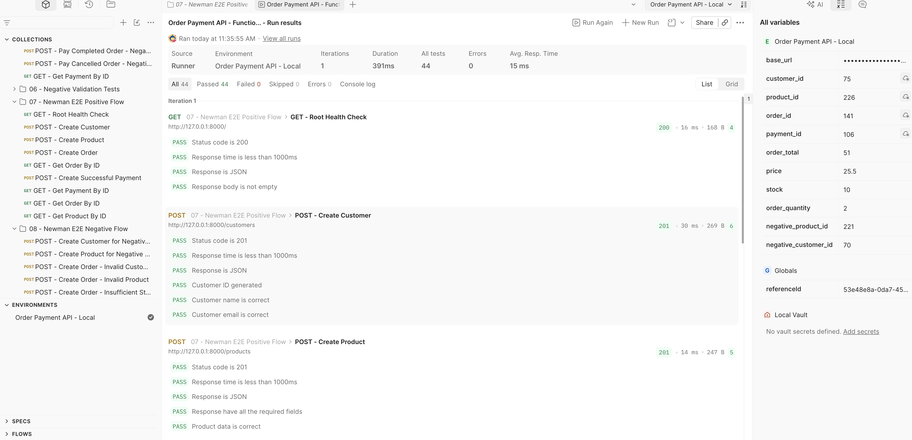
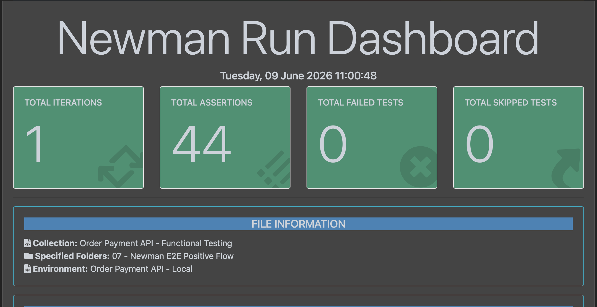
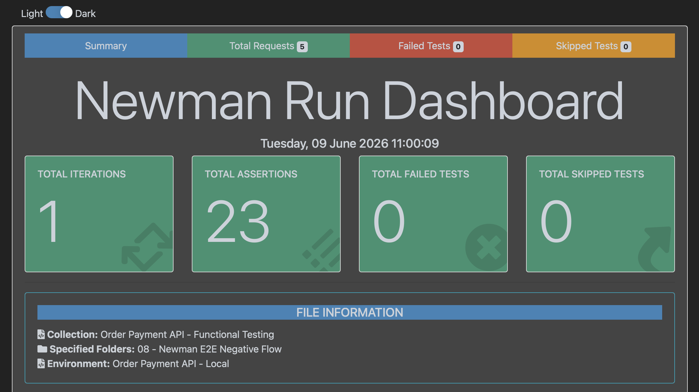
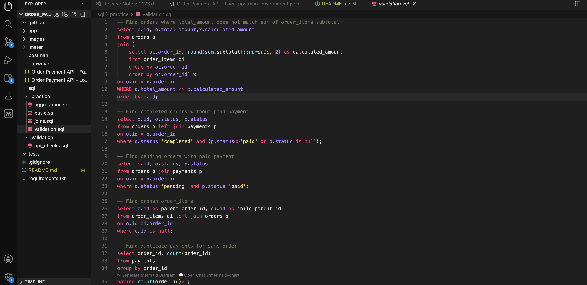

# Order + Payment Simulation API (QA Project)

## Goal

Build and test a backend system that simulates order creation and payment processing, with a focus on API validation, database consistency, and backend QA practices.

---

## Project Status

### Completed

- FastAPI backend application
- PostgreSQL database with 5 related tables
- API endpoint development
- Manual API testing using Postman
- Database validation using SQL queries
- End-to-End positive workflow testing
- End-to-End negative workflow testing
- Newman CLI automation
- Newman HTML report generation

### In Progress

- JMeter performance testing
- GitHub Actions CI pipeline

---

## Scope

The system includes:

- Customers → who is buying
- Products → what is being sold
- Orders → customer purchases
- Order Items → products within an order
- Payments → payment processing

### Relationships

- 1 Customer → Many Orders
- 1 Order → Many Order Items
- 1 Product → Many Order Items
- 1 Order → 1 Payment

### Core Business Flow

1. Create customer
2. Create product
3. Create order
4. Process payment
5. Update order status
6. Validate database consistency

---

## QA Focus

- API testing (positive and negative scenarios)
- Request and response validation
- Database validation using SQL
- Data integrity verification
- End-to-End workflow testing
- API automation using Newman
- Performance testing using JMeter
- CI execution using GitHub Actions

---

## Tech Stack

### Backend

- FastAPI
- PostgreSQL
- SQLAlchemy
- Pydantic
- Uvicorn

### API Testing

- Postman
- Newman

### Database Validation

- PostgreSQL
- TablePlus

### Tools

- Git
- GitHub
- VS Code
- iTerm2

### Planned

- JMeter
- GitHub Actions

---

## Data Model

### Customers

| Field Name | Type | Description |
|------------|------|-------------|
| id | int | Primary key |
| name | string | Customer name |
| email | string | Unique email |
| created_at | datetime | Record creation time |

---

### Products

| Field Name | Type | Description |
|------------|------|-------------|
| id | int | Primary key |
| name | string | Product name |
| price | float | Product price |
| stock | int | Available quantity |
| created_at | datetime | Record creation time |

---

### Orders

| Field Name | Type | Description |
|------------|------|-------------|
| id | int | Primary key |
| customer_id | int | Reference to customers table |
| status | string | pending / completed / cancelled |
| total_amount | float | Total order amount |
| created_at | datetime | Record creation time |

---

### Order Items

| Field Name | Type | Description |
|------------|------|-------------|
| id | int | Primary key |
| order_id | int | Reference to orders table |
| product_id | int | Reference to products table |
| quantity | int | Number of items |
| price | float | Price at time of order |
| subtotal | float | quantity × price |

---

### Payments

| Field Name | Type | Description |
|------------|------|-------------|
| id | int | Primary key |
| order_id | int | Reference to orders table |
| amount | float | Payment amount |
| status | string | paid / pending / failed |
| payment_time | datetime | Time of payment |

---

## API Endpoints

### Customers

- POST /customers → Create customer
- GET /customers/{customer_id} → Get customer details
- GET /customers/{customer_id}/orders → Get all order for a customer

### Products

- POST /products → Create product
- GET /products/{product_id} → Get product details

### Orders

- POST /orders → Create order
- GET /orders/{order_id} → Get order details
- PATCH /orders/{order_id}/cancel → Cancel pending order
- PATCH /orders/{order_id}/cancel → Cancel completed order
- PATCH /orders/{order_id}/cancel → Cancel already cancelled order

### Payments

- POST /payments → Process successful payment
- GET /payments/{payment_id} → Get payment details
- POST /payments → Failed payment - wrong amount
- POST /payments → Failed payment - already completed order
- POST /payments → Failed payment - cancelled order

---

## API Testing Coverage

### Positive Scenarios

- Create customer successfully
- Create product successfully
- Create order successfully
- Retrieve order details
- Process payment successfully
- Retrieve payment details
- Verify order status changes to completed
- Verify product stock decreases after order creation

### Negative Scenarios

- Invalid customer ID
- Invalid product ID
- Insufficient stock
- Duplicate customer email
- Invalid product price
- Invalid product stock value
- Payment amount mismatch
- Attempt payment on completed order
- Attempt payment on cancelled order

---

## End-to-End Positive Flow

1. Create Customer
2. Create Product
3. Create Order
4. Verify Order Creation
5. Create Payment
6. Verify Payment
7. Verify Order Status
8. Verify Product Stock

---

## End-to-End Negative Flow

1. Invalid Customer
2. Invalid Product
3. Insufficient Stock
4. Payment Amount Mismatch

---

## Newman Automation and Generate HTML Report

Newman was used to execute automated End-to-End API workflows from the command line.

### Execute Positive Flow

bash newman run "Order Payment API - Functional Testing.postman_collection.json" -e "Order Payment API - Local.postman_environment.json" --folder "07 - Newman E2E Positive Flow" -r cli,htmlextra --reporter-htmlextra-export newman/positive-e2e-newman-report.html 

### Execute Negative Flow

bash newman run "Order Payment API - Functional Testing.postman_collection.json" -e "Order Payment API - Local.postman_environment.json" --folder "08 - Newman E2E Negative Flow" -r cli,htmlextra --reporter-htmlextra-export newman/negative-e2e-newman-report.html 

---

## Database Validation

Sample SQL validations performed:

- Order totals match item subtotals
- Product stock updates after order creation
- Completed orders have successful payments
- Pending orders do not have successful payments
- Products never ordered
- Customers with no orders
- Duplicate payment detection
- Monthly order and revenue reporting
- Top selling products
- Data integrity checks across related tables

---

## Tools Summary

| Tool | Used For | Why |
|------|-----------|-----|
| FastAPI | Build API | Controlled backend project |
| PostgreSQL | Database | Real database validation |
| SQLAlchemy | ORM | Database interaction |
| Pydantic | Validation | Request validation |
| Uvicorn | API Server | Local development |
| TablePlus | Database UI | SQL validation |
| Postman | API Testing | Manual testing |
| Newman | Automation | CLI execution and reporting |
| JMeter | Performance Testing | Load testing |
| GitHub | Portfolio | Source control and visibility |
| VS Code | Development | Main editor |
| iTerm2 | Terminal | Command-line execution |

---
# Screenshots

## Postman Collection Run

## Newman Positive Flow Report

## Newman Negative Flow Report

## Database Validation

